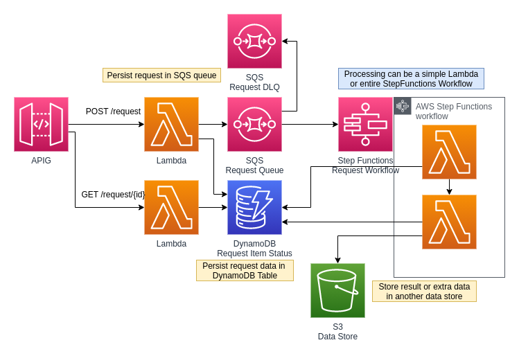

# Async Processor
An API pattern that uses SQS queues and a DynamoDB table to track requests and process them asynchronously. The sender can retrieve the status of the request and result at their own leisure.

## Features
- Requests are stored in durable processing queue with a dead-letter queue to catch failures. 
- Request status and metadata is stored in DynamoDB for quick lookups and updates.
- Request and Response status is fully decoupled from processing workflow.

### TODO

- [x] create Request client to centralize API operations
- [x] use custom dynamodb table schema
- [x] use AJV for object/request validation